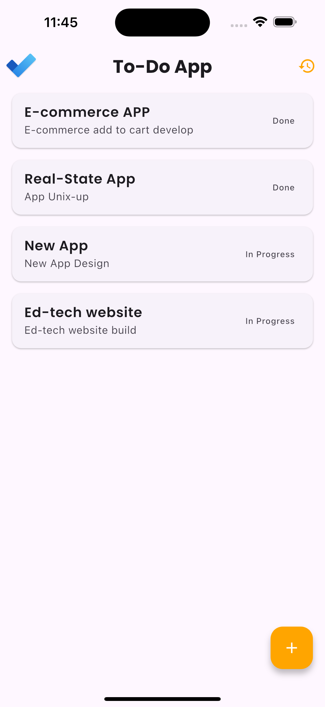
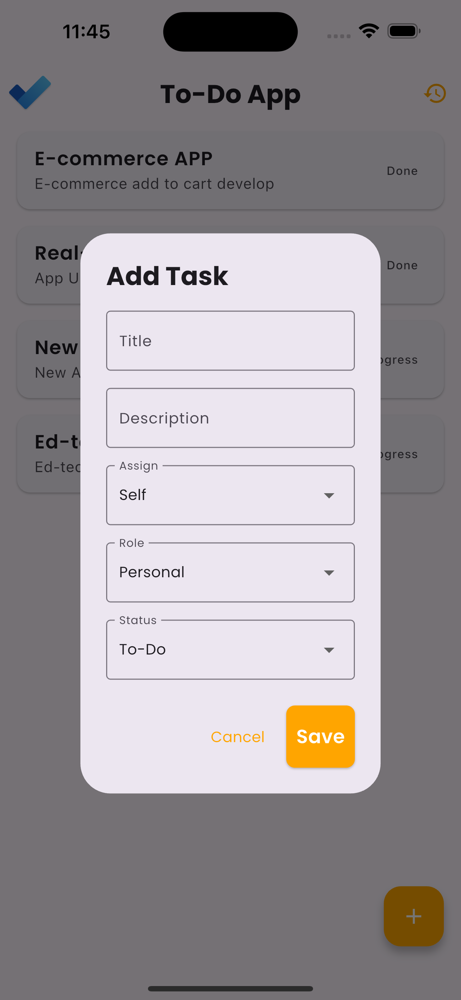
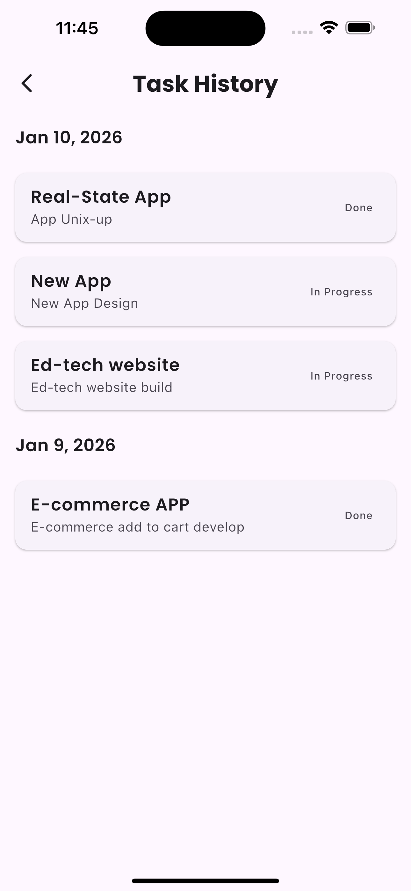
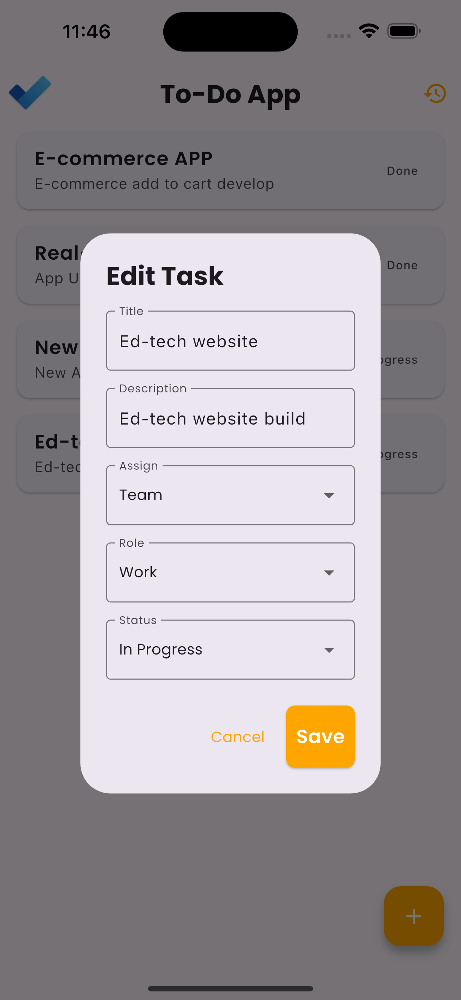
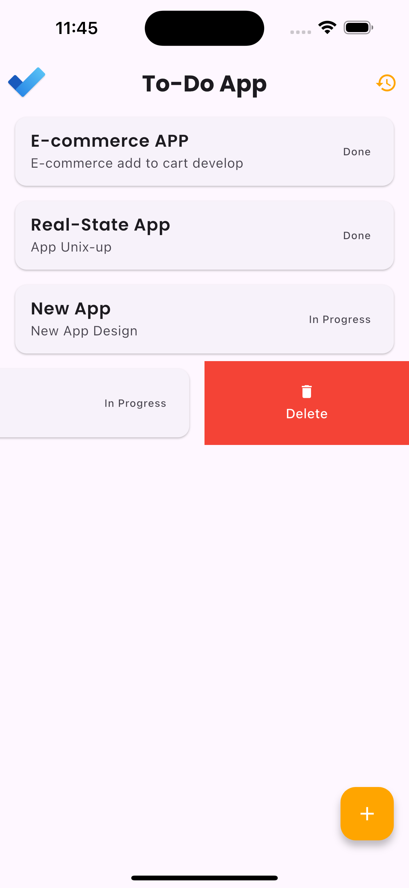

# 📝 Flutter Pro Task Manager


---

## 🚀 Key Features

*   **Clean & Modern UI:** Aesthetically pleasing design with a focus on usability.
*   **Full CRUD Functionality:** Create, read, update, and delete tasks seamlessly.
*   **State Management with GetX:** Efficient and reactive state management for a smooth UX.
*   **Local Persistence with Hive_CE:** High-performance, NoSQL database for offline-first capabilities.
*   **Interactive Task Management:**
    *   **Swipe to Delete:** Quickly discard tasks with a simple gesture.
    *   **Long-Press Actions:** Access contextual options with haptic feedback.
*   **Task History:** View tasks grouped by date for better organization.
*   **Reusable Components:** Modular UI widgets for consistency and rapid development.
*   **Clean Architecture:** Follows MVC principles for a scalable and testable codebase.

---

## 📱 App Preview


<p align="center">
    <tr>
      <td align="center"><b>Dashboard</b></td>
      <td align="center"><b>Create/Edit Task</b></td>
      <td align="center"><b>Task History</b></td>
    </tr>
    <tr>
      <td></td>
      <td></td>
      <td></td>
    </tr>
    <tr>
      <td align="center"><b>Update Task</b></td>
      <td align="center"><b>Swipe/Delete Action</b></td>
    </tr>
    <tr>
      <td></td>
      <td></td>
    </tr>
</p>


## 📂 Project Structure

```text
lib/
├── app/
│   ├── constants/
│   │   ├── app_colors.dart
│   │   ├── app_constants.dart
│   │   ├── app_text_styles.dart
│   │   └── hive_constants.dart
│   ├── controller/
│   │   └── task_controller.dart
│   ├── data/
│   │   ├── models/
│   │   │   └── task.dart
│   │   └── services/
│   │       └── hive_service.dart
│   └── ui/
│       ├── screens/
│       │   ├── home_screen.dart
│       │   └── task_history_screen.dart
│       └── widgets/
│           ├── custom_button.dart
│           ├── custom_dropdown.dart
│           └── custom_text_field.dart
└── main.dart
```


